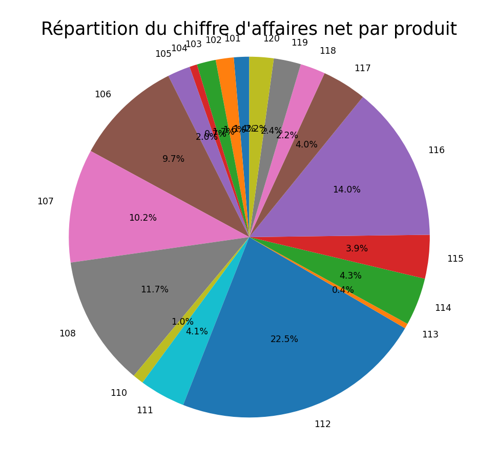
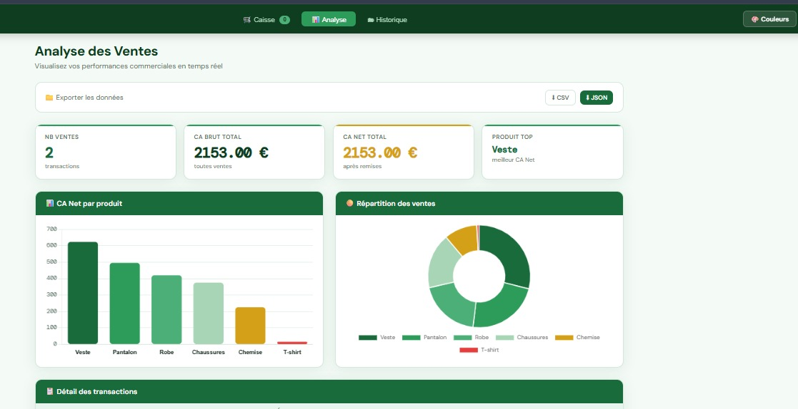

# Système d’Automatisation et d’Analyse des Ventes
**Projet de Fin d'Année — Matière : Logiciels**

## 🛠️ Technologies utilisées


---
🔗 Dépôt GitHub : https://github.com/naaaaaaaazz/automatisation-ventes

<p align="center">
  
</p>

## 🖇️ Description
Ce projet répond au besoin d’une entreprise de e-commerce dont le volume de données de ventes est devenu trop important pour être géré dans un tableur classique.
Un script Python a été développé pour automatiser la lecture du fichier CSV, effectuer les calculs financiers (chiffre d’affaires brut, net et TVA), identifier le produit le plus rentable, générer un fichier de résultats et proposer une visualisation graphique.

## 📍Objectif
Automatiser le traitement et l’analyse des données de ventes afin de gagner du temps, réduire les erreurs et faciliter la prise de décision.

---

## 🚀 Présentation générale

Ce projet est un système complet d’automatisation et d’analyse des ventes composé de trois modules :

- 🐍 **Script Python** : traitement et analyse des données de ventes  
- 📊 **Dashboard Streamlit** : visualisation interactive des résultats  
- 🌐 **Application web (VentePro)** : interface HTML pour la gestion de caisse et l’analyse des ventes  

## 📁 Structure du projet
```
automatisation-ventes/
│
├── ventes.csv
├── vente.py
├── vente.html
├── app.py
├── resultats_final.csv
├── requirements.txt
├── image.png
├── Figure_1.png 
├── figure2.png
├── apercudashboard.png
├── apercu-site.png
└── README.md
```
## 🌐 Clonage et installation du projet

### 📌 Prérequis

Avant de commencer, configurez votre identité Git :

```bash
git config --global user.name "Votre Nom"
git config --global user.email "votre-email@exemple.com"
```

### 📥 Clonage du projet avec VS Code
1. Ouvrir Visual Studio Code
2. Appuyer sur `Ctrl + Shift + P`
3. Taper : Git: Clone
4. Coller l’URL du dépôt GitHub :
```
https://github.com/naaaaaaaazz/automatisation-ventes 
```
5. Choisir un dossier de destination sur votre ordinateur
6. Cliquer sur Open pour ouvrir le projet dans VS Code

### ▶️ Installation et exécution

1. Créer un environnement virtuel :

```
python -m venv venv
```

2. Activer l’environnement :

```
venv\Scripts\activate
```

3. Installer les dépendances :

```
pip install -r requirements.txt
```

4. Lancer le programme :

```
python vente.py
```

## 📥 Données d'entrée  
Le fichier ventes.csv doit utiliser le point-virgule `;` comme séparateur et contient les informations suivantes :

```
ID;Prix;Quantite;Remise
101;15.0;3;10
102;25.0;2;5
...
120;80.0;1;20
```

- **ID** : Identifiant du produit  
- **Prix** : Prix unitaire  
- **Quantite** : Quantité vendue  
- **Remise** : Réduction (%)


## ⚙️ Fonctionnalités
1. Lecture du fichier csv `ventes.csv`
2. Calcul du **CA Brut** (Chiffre d’Affaires Brut) : `Prix × Quantité`
3. Calcul du **CA Net** (Chiffre d’Affaires Net) : `CA_Brut × (1 - Remise / 100)`
4. Calcul de la **TVA** (20%) : `CA_Net × 0.20`
5. Affichage du **CA Total** de l'entreprise `Somme de tous les CA Net`
6. Identification du **produit le plus rentable**
7. Génération d’un nouveau fichier `resultats_final.csv`
8. Affichage des résultats sous forme de tableau

## 🎯 Résultat attendu

Après exécution, le programme :
- Génère un fichier resultats_final.csv
- Affiche le chiffre d’affaires total
- Identifie le produit le plus rentable
- Affiche un graphique des ventes

## 📊 Visualisation

Le script affiche :
- un graphique en barres (CA net par produit)
- un graphique circulaire (répartition des ventes)

### 📈 Graphique en barres

<p align="center">
  
</p>

### 🥧 Graphique circulaire

<p align="center">
  
</p>

## 🌐 Dashboard interactif (Streamlit)

En complément du script Python, une interface graphique a été développée avec **Streamlit** afin de rendre l’analyse des ventes plus simple, rapide et interactive.

Ce dashboard fonctionne comme une **application web locale**, accessible via un navigateur.

---

### ⚙️ Fonctionnalités du dashboard

- 📥 Importation d’un fichier CSV depuis l’interface  
- 📊 Affichage des données sous forme de tableau  
- 📈 Visualisation graphique du chiffre d’affaires net  
- 📌 Affichage des indicateurs clés (KPI) :
  - Chiffre d’affaires total  
  - Nombre de produits  
  - Meilleur produit  
- 🏆 Identification automatique du produit le plus rentable  
- 📤 Téléchargement des résultats au format CSV  

---

### ▶️ Lancer le dashboard

Après installation des dépendances :

```
streamlit run app.py
``` 
### 📸 Aperçu du dashboard

💡 Capture d’écran après importation du fichier CSV et affichage des résultats
<p align="center">
  
</p>

## 🌐 Site Web interactif (VentePro)

En complément du script Python, une interface web moderne a été développée afin de gérer la caisse et analyser les ventes de manière simple, rapide et interactive.

Cette application fonctionne directement dans le navigateur, sans installation.

---

  ### ⚙️ Fonctionnalités du site

- Gestion de caisse (ajout de produits, remises, génération de tickets)
- Tableau de bord avec KPI et graphiques
- Historique des ventes
- Import et export des données (CSV / Excel)
- Interface web interactive et personnalisable

---

### ▶️ Lancer le site (serveur local)

```
python -m http.server 8000
``` 

Puis ouvrir dans le navigateur :

```
http://localhost:8000/vente.html
``` 
### 📸 Aperçu du site web

#### 📊 Analyse des ventes (import CSV + résultats)
<p align="center">
  
</p>

## 📤 Fichier de sortie

Le fichier resultats_final.csv contient :
`ID;Prix;Quantite;Remise;CA_Brut;CA_Net;TVA`

## 🧠 Compétences mobilisées

* Programmation en Python
* Manipulation de fichiers CSV
* Analyse de données
* Visualisation avec Matplotlib
* Gestion d'environnement virtuel (venv)
* Utilisation de VS Code
* Débogage (Debug)
* Développement d'interface web (Streamlit)
* Développement web front-end (HTML)
* Git & GitHub

## ⭐ Bonus réalisés

✔️ Lecture dynamique des fichiers CSV  
✔️ Visualisation graphique avec Matplotlib (barres + circulaire)  
✔️ Dashboard interactif avec Streamlit  
✔️ Site web complet (VentePro) avec gestion de caisse  

## 🔧 Gestion du projet avec Git

Commandes utilisées :

```
git init
git add .
git commit -m "Projet final"
git remote add origin https://github.com/naaaaaaaazz/automatisation-ventes
git push -u origin main

```
👉 Ces commandes permettent d’initialiser un dépôt Git, sauvegarder les modifications et envoyer le projet sur GitHub.
## 👩‍💻 Auteurs

- **HOUAMI Molka**    
- **LOUATI Mariem**  
- **JAZZAR Emna**   

Projet réalisé en collaboration.

---
## 🎯 Conclusion

Ce projet propose une solution complète de gestion et d’analyse des ventes basée sur Python, Streamlit et une interface web.

Il automatise le traitement des données, réduit les tâches manuelles et fournit des visualisations interactives facilitant la prise de décision.

L’ensemble illustre un flux complet allant de la collecte des données jusqu’à leur exploitation.